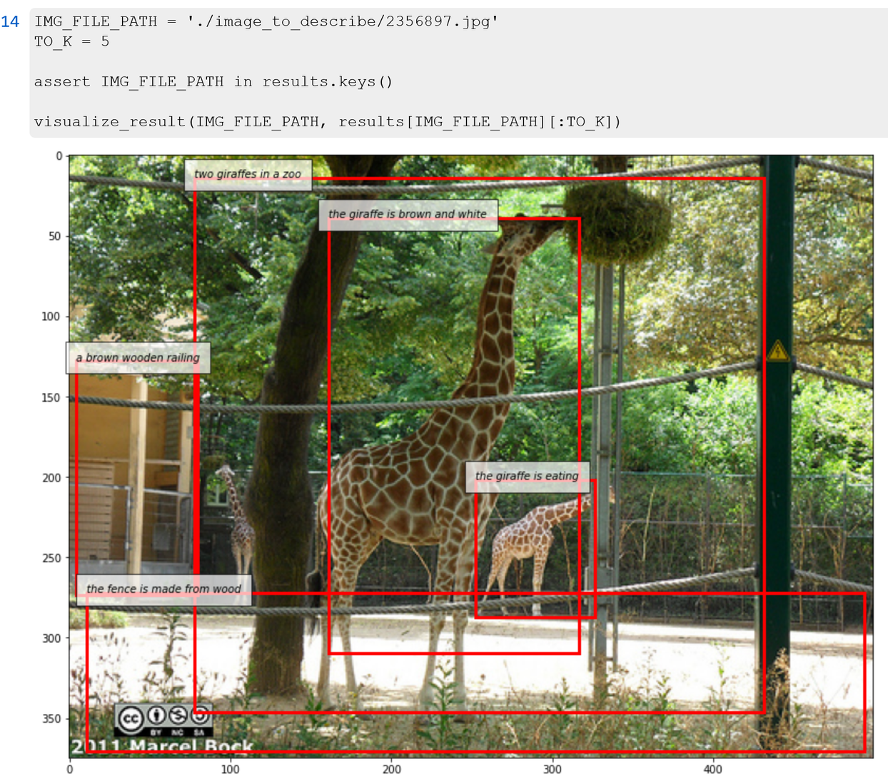

# Densecap in Pytorch

A simplified pytorch version of [jcjohnson/densecap](https://github.com/jcjohnson/densecap)
> Issue or Contact me directly by yhshi@bupt.edu.cn

## What is densecap?
* Detect regions from an image and describe each region with a short sentence. 
  
* See [jcjohnson's repo](https://github.com/jcjohnson/densecap) or [their paper](https://cs.stanford.edu/people/karpathy/densecap/)

## What about this implementation?
* Things are up to date: Python 3.7 and pytorch 1.4.0
* Our model code inherits GeneralizedRCNN from [torchvision](https://pytorch.org/vision/stable/index.html) directly and try to keep it easy to understand and use (wish to be). **So the region detector part is not the same as the original paper**.
* Should be trainable on a single GTX 1080Ti GPU with 12GB memory.

## Requirments
* python 3.7
* pytorch 1.4.0 
* torchvision 0.5.0
* numpy
* PIL
* h5py
* tqdm
* tensorboard
* Prefetch version of DataLoader: https://github.com/IgorSusmelj/pytorch-styleguide/issues/5
* apex: https://github.com/NVIDIA/apex (to speed up training)
* nlgeval*: https://github.com/Maluuba/nlg-eval

> **Note**: We use nlgeval to calculate Meteor, you can modify evaluate.py to use other methods like coco-eval.

## Pre-preprocess

1. `mkdir ./data` and place [Visual Genome Dataset](http://visualgenome.org/) in a sub directory `visual-genome`
    * Images are in two directories `./data/visual-genome/VG_100K` and `./data/visual-genome/VG_100K_2`
    * Annotation files are `./data/visual-genome/region_descriptions.json` and `./data/visual-genome/image_data.json`
2. `python preprocess.py`
3. Now we get `./data/VG-regions-dicts-lite.pkl` and `./data/VG-regions-lite.h5`. See preprocess.py for more details.
4. After preprocessing, file structures are listed below:
```
    data
    ├── visual-genome
    │   ├── VG_100K
    │   ├── VG_100K_2
    │   ├── region_descriptions.json
    │   └── image_data.json
    ├── VG-regions-dicts-lite.pkl
    └── VG-regions-lite.h5
```


## Start Training

1. `mkdir model_params`
2. `python train.py`
3. change settings by `set_args()` and global variables

## Evaluating

> Since we need to combine metrics from vision and language, we rewrite the [Lua version](https://github.com/jcjohnson/densecap/tree/master/eval) and the code is in `./model/evaluator.py`.

* We provide functions to evaluate in the script `evaluate.py`. 
* You can use `describe.py` to do inference on your images.
* Visualize bounding boxes and their descriptions in `vg_dataset_visualization.ipynb`

## Trained model

We provide a playable checkpoint, Here is the link - [OneDrive](https://1drv.ms/u/s!AmN4YCVEJTAIhcEL0HQDwgl79REDzQ?e=xYKEO1) or [BaiduYun](https://pan.baidu.com/s/17-4CnOWHK-ksLKRAzC2JVQ) (code is `lysh`)
* It is initiated from the pretrained torchvision Faster R-CNN and trained for at most 10 epochs on the training set.
* Place the checkpoint (`.pth.tar`) and the directory under `./model_params` 

Performance on the val set (`train_all_val_all_bz_2_epoch_10_inject_init.pth.tar`):
```json
{
  "map": 0.09381764795879523,
  "ap_breakdown": {
    "iou_0.3_meteor_0": 0.27547998070716856,
    "iou_0.3_meteor_0.05": 0.20472119629383087,
    "iou_0.3_meteor_0.1": 0.1440167324244976,
    "iou_0.3_meteor_0.15": 0.07862544938921928,
    "iou_0.3_meteor_0.2": 0.042336766347289084,
    "iou_0.3_meteor_0.25": 0.023921287432312966,
    "iou_0.4_meteor_0": 0.2457992273569107,
    "iou_0.4_meteor_0.05": 0.18552129060029984,
    "iou_0.4_meteor_0.1": 0.13265080079436303,
    "iou_0.4_meteor_0.15": 0.07398858115077019,
    "iou_0.4_meteor_0.2": 0.04003382280468941,
    "iou_0.4_meteor_0.25": 0.02333026934415102,
    "iou_0.5_meteor_0": 0.20341708421707153,
    "iou_0.5_meteor_0.05": 0.15629490286111833,
    "iou_0.5_meteor_0.1": 0.11364261746406555,
    "iou_0.5_meteor_0.15": 0.06471541225910186,
    "iou_0.5_meteor_0.2": 0.035920637771487234,
    "iou_0.5_meteor_0.25": 0.021687612012028692,
    "iou_0.6_meteor_0": 0.15223818764090538,
    "iou_0.6_meteor_0.05": 0.11921414405107499,
    "iou_0.6_meteor_0.1": 0.08984904080629348,
    "iou_0.6_meteor_0.15": 0.052889608442783356,
    "iou_0.6_meteor_0.2": 0.03046290695667267,
    "iou_0.6_meteor_0.25": 0.018970464691519737,
    "iou_0.7_meteor_0": 0.09079854160547257,
    "iou_0.7_meteor_0.05": 0.07260968565940856,
    "iou_0.7_meteor_0.1": 0.056333212852478026,
    "iou_0.7_meteor_0.15": 0.03415838725864887,
    "iou_0.7_meteor_0.2": 0.01916669186204672,
    "iou_0.7_meteor_0.25": 0.011734895706176758
  },
  "detmap": 0.25295563289523126,
  "det_breakdown": {
    "iou_0.3": 0.37301586389541624,
    "iou_0.4": 0.3269594985246658,
    "iou_0.5": 0.26560761243104936,
    "iou_0.6": 0.18992780923843383,
    "iou_0.7": 0.10926738038659095
  }
}
```

## Developer
* [soloist97](https://github.com/soloist97)
* [fuyun1107](https://github.com/fuyun1107)